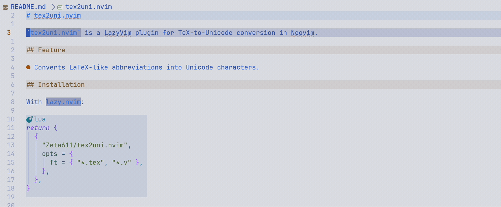

# tex2uni.nvim

`tex2uni.nvim` is a LazyVim plugin for TeX-to-Unicode conversion in Neovim.



## Feature

- Converts LaTeX-like abbreviations into Unicode characters.

## Installation

With `lazy.nvim`:

```lua
return {
  {
    "Zeta611/tex2uni.nvim",
    opts = {
      ft = { "*.{tex,v}" }, -- enable for specific filetypes
      abbreviations = {
        extra = {
          ["pure"] = "⌜$CURSOR⌝", -- add custom abbreviations
        },
      },
    },
  },
}
```

## Acknowledgements

I have packaged this with permission from [LimitEpsilon](https://github.com/LimitEpsilon), who originally wrote this, who again extracted the TeX-to-unicode conversion routine from [lean.nvim](https://github.com/Julian/lean.nvim).
